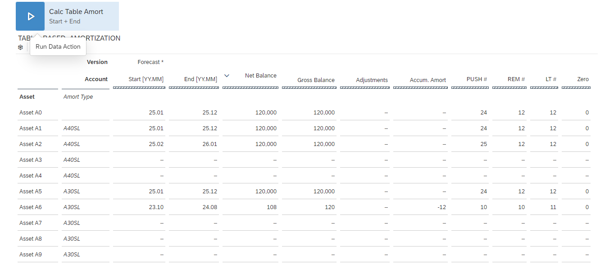

# Table based amortization

## Content Package Files
SAP_CC_SAC_Table_based_Amortization.package

## Last Released:
2024.10

## What´s New
The Table_based_Amortization content package contains classic stories or classic analytical applications.
As explained in this [blog](https://community.sap.com/t5/technology-blogs-by-sap/important-notice-changes-in-sap-analytics-cloud-classic-stories-amp/ba-p/13705220), it will no longer be supported to import this content package starting with 2024 Q4 QRC for new tenants only, as it contains Classic Stories or Analytic Applications.
Once the SAP Analytics Cloud Classic Experience for Stories and Analytic Applications will no longer be supported in general, this package will be deprecated (current planning: 2025 Q2 QRC).
 

## Descripton
In the Media industry there are business requirements for certain Media assets (Films and TV shows) to amortize Costs based on pre-defined Amortization tables (“Curves”).

Curve Example 3M30_SL: 30% amortization for one quarter, then stragith line for remaining periods.
This data action has been optimized 

## Details
Story: Table Based Amortization       
Model: TABLE_BASED_AMORTIZATION; comes with sample data and two data actions:      
<ul>
<li>CTA_END_SL - data action for Amortization Expense calculation</li>
<li>Seed Test Data - data action to generate large volume of test data</li>
</ul>

Detailed Table_Based_Amortization.pdf instructions how to set up and use the amortization package.

## Connectivity
N/A

## Download/Install Instructions
Please check the documentation [here](https://help.sap.com/docs/SAP_ANALYTICS_CLOUD/42093f14b43c485fbe3adbbe81eff6c8/ef516563b3fe4c69b6f718f17ed94cdf.html).

## More Information
Please read the attached Table_Based_Amortization.pdf carefully before working with the content.

## Contact
Please reach out to [Christopher Bavington](mailto:christopher.bavington@sap.com).
