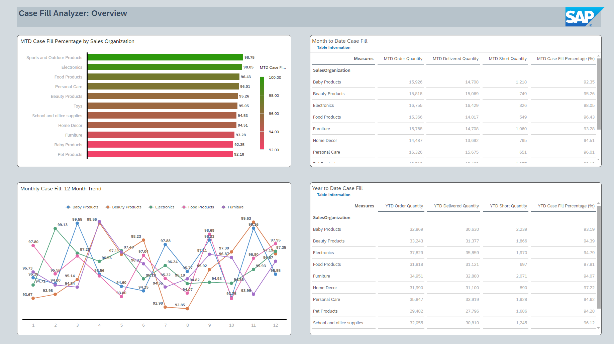

# Community Content Title
Case Fill Optimization Dashboard

## Content Package Files
SAP_CC_SAC_Case_Fill_Optimization.package  
SAP_CC_DSP_Case_Fill_Optimization.package

## Last Released:
2024.03

## What´s New
 N/A

## Description
Business Challenge: Ensuring optimal case fill percentages is a critical challenge for companies involved in supply chain management, especially with critical data sitting in disparate systems ranging from SAP S/4HANA and third-party providers. Inefficiencies in the fulfillment process can lead to missed sales opportunities, customer dissatisfaction, and increased operational costs. The lack of real-time visibility into key performance indicators, such as month-to-date (MTD) and year-to-date (YTD) case fill rates, as well as detailed insights into case fill by shipping status, distribution channels, and financial metrics, hinders the ability of decision-makers to proactively address issues and make data-driven improvements. Without a comprehensive overview of case fill performance, companies may struggle to identify bottlenecks, assess the impact of shipping and delivery variations, and optimize their supply chain operations to meet customer demand effectively.

Solution: The implemented solution leverages Datasphere and SAP Analytics Cloud to address the challenges associated with case fill optimization. SAP S/4HANA sales data and third-party delivery data is harmonized in Datasphere to build a robust data model. Through a direct connection with SAP Analytics Cloud, a centralized dashboard powered by advanced analytics tools provides decision-makers with a holistic view of MTD and YTD case fill rates, enabling them to quickly assess overall performance. The secondary pages offer detailed visualizations focused on case fill by shipping status, delivery types, distribution channels, and various financial aspects. Decision-makers gain actionable insights into the factors influencing case fill, allowing them to optimize shipping processes, refine distribution strategies, and enhance overall supply chain efficiency.

## Details
This package contains a SAP Analytics Cloud story and a corresponding data model in SAP Datasphere

## Connectivity
A live connection to SAP Datasphere is required. Please use the connection name SAPDWC

## Download/Install Instructions
Please check the documentation [here](https://help.sap.com/docs/SAP_ANALYTICS_CLOUD/42093f14b43c485fbe3adbbe81eff6c8/ef516563b3fe4c69b6f718f17ed94cdf.html)

Before installing this package, ensure that the Time Tables & Date Dimensions have been generated in the destination space. Details [here](https://help.sap.com/docs/SAP_DATASPHERE/be5967d099974c69b77f4549425ca4c0/c5cfce4d22b04650b2fd6078762cdeb9.html).

## Contact
[Rafiq Islam](mailto:rafiq.islam@sap.com), [Hamza Jamal](mailto:hamza.jamal@sap.com) 
