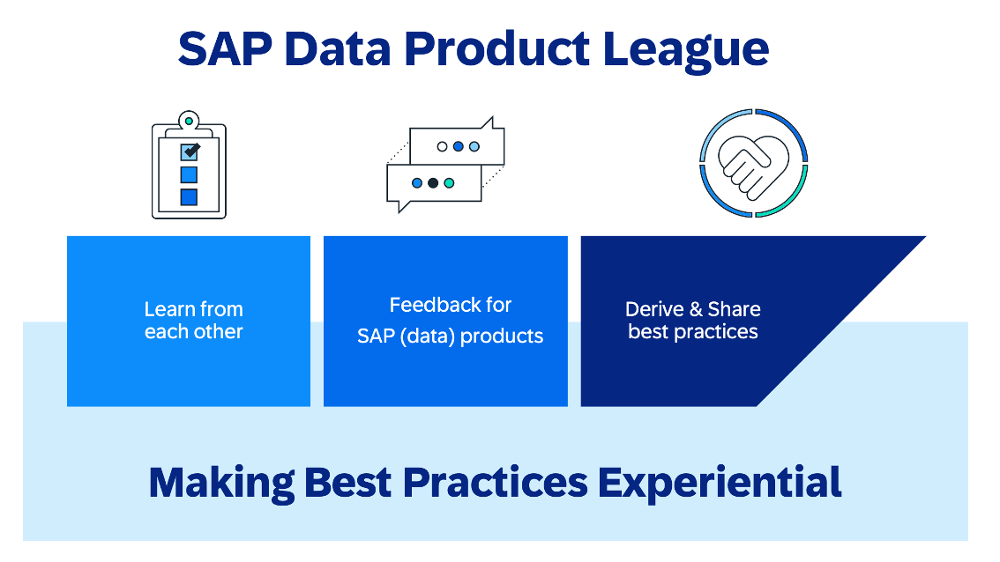
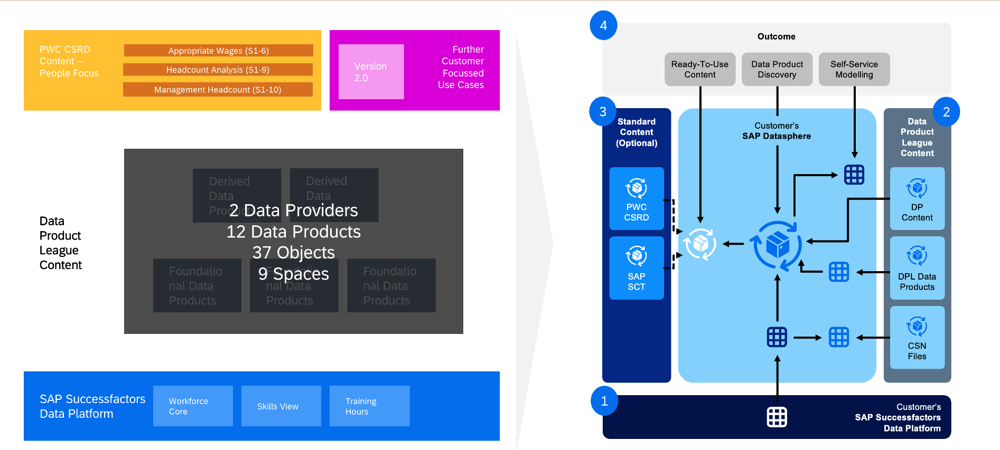

# Data Product League

## Content Files
DP Appropriate Wages.json  
DP Employee for CSRD.json  
DP Headcount Actuals.json  
DP Headcount for Employee.json  
DP Headcount per Age Group.json  
DP Headcount Top Management.json  
DP Minimum Wage.json  
DP Salary Analysis.json  
DP Salary.json  
DP Workforce Location.json  

## Last Released:
2024.05

## What´s New
N/A

## Descripton
The Data Product League is a group of customers that share the belief in data products with its transformative power for enabling the data-driven company beyond IT constraints. This group has the goal to collaborate on the data products that SAP deliver and derive best practices for their adoption in SAP Datasphere. Despite individual success, the broader goal of the Data Product League is to put these learnings and alignments into content that anyone can use as a starter kit for their data product journey. 

## Details
The first version of the content from the Data Product League will focus around sustainability in the context of HR. It will focus on Salary & Headcount Analysis in order to be compliant with the EU CSRD Standards S1-6, S1-9 and S1, 10. The basis for it will be the first three SAP Successfactors Data Products Workforce Core, Skills View & Training Hours.  

The Data Product League Demo Content offers a streamlined and efficient approach to integrating and utilizing data products within the SAP ecosystem. By following the provided steps illustrated in the image above and described below organizations can unlock numerous advantages, enhancing their data management and utilization capabilities.
1.	Connect your SAP Successfactors assets
   
•	Seamless Integration: Easily connect your SAP SuccessFactors assets to the Data Product League, ensuring a smooth and hassle-free integration process. 
• Centralized Data Management: Consolidate your data from various SAP SuccessFactors modules, enabling better data governance and management.

3.	Activate SAP Data Product League assets
   
•	Quick Activation: Activate data products swiftly, reducing the time required to start leveraging valuable data insights with the delivered CSN-Files. 
•	Enhanced Data Utilization: Gain immediate access to a wide range of pre-configured data products, ready to be used in your analysis and decision-making processes.

6.	Use Data Product directly in SAP or Ecosystem content
   
•	Interoperability: Utilize data products directly within SAP or third-party ecosystem content, ensuring seamless data flow across different platforms and applications. 
•	Flexibility: Adapt and customize data products to fit specific business requirements, providing tailored solutions for various departments.

8.	Experience a Data Product-centric data value chain
   
•	End-to-End Visibility: Achieve comprehensive visibility into your data value chain, from data ingestion to utilization, enhancing overall transparency. 
•	Data-Driven Decisions: Leverage a data product-centric approach to drive strategic decisions, improving business outcomes.

The Data Product League Demo Content not only simplifies the process but also provides a robust foundation for a data product-centric data value chain, driving improved decision-making, operational efficiency, and strategic innovation. 

## Connectivity
N/A

## Download/Install Instructions
Follow the Details section for more information. 

## More Information
N/A

## Contact
If you have feedback for the content, need help with the installation or want to join the Data Product league, reach out to us [Data Product League email](dataproductleague@sap.com)  
