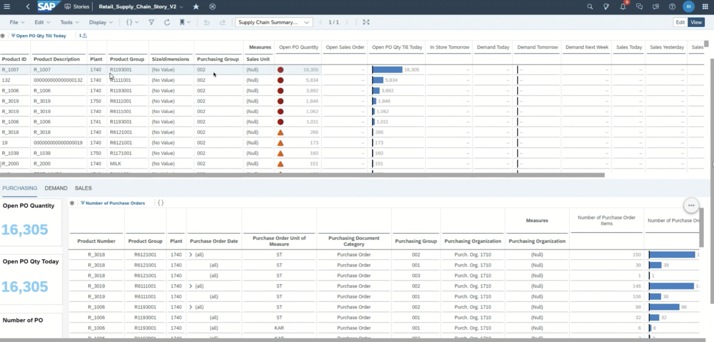

# Retail Supply Chain Dashboard

## Content Package Files
SAP_CC_SAC_Retail_Supply_Chain.package  
SAP_CC_DSP_Retail_Supply_Chain.package

## Last Released:
2023.05

## What´s New
Inital release

## Descripton
The Supply-Chain dashboard brings together select KPIs from procurement, demand, and sales for an end-to-end visibility of the inventory at a plant (Warehouse) level to aid with daily operations. The primary target for this dashboard is Retail. Within the Retail vertical, the dashboard may be applicable to industries utilizing the Vendor-Warehouse-Store model or the Vendor-Store model. The Supply-Chain dashboard provides a tabular view of KPIs at the product and plant level. Company Code and Organization selection is mandatory; the Users are encouraged to select additional categories such as Plant, Merchandising Category or Purchasing Manager for data volume management and for an in-depth look at a specific product. From the summary view, the User can select a plant-product combination for a deep dive into Purchase Orders, Sales and/or Invoicing documents.

SAP_CC_Retail_Supply_Chain_Screenshot.png

## Details
N/A

## Connectivity
Based on SAP Datasphere data models. Connect to your SAP S/4HANA system to load data in the SAP Datasphere models.

## Download/Install Instructions
Please check the documentation [here](https://help.sap.com/docs/SAP_ANALYTICS_CLOUD/42093f14b43c485fbe3adbbe81eff6c8/603e26204ce14bd8b5f9729a8123636f.html).

Before installing this package, ensure that the Time Data (Time tables and dimensions) have been generated in the destination space. Details [here](https://help.sap.com/docs/SAP_DATASPHERE/be5967d099974c69b77f4549425ca4c0/c5cfce4d22b04650b2fd6078762cdeb9.html).  ---

Before installing this package, ensure that the Currency Conversion tables have been generated in the destination space. Details [here](https://help.sap.com/docs/SAP_DATASPHERE/c8a54ee704e94e15926551293243fd1d/b462239ffb644d9baab4442a10a72edf.html).

## More Information
Calculations for KPI used in the SAP Analytics Cloud story:

Open Purchase Order Quantity:
Purchase Order Schedule Line: Schedule Line Order Quantity – Rough Goods Receipt Qty where Purchasing Document Deletion Code = ’’ and Purchase Order Item Category <> (‘9’ or ‘1’) and PO Schedule Line Is Completely Delivered <> 'X’ 

Open Purchase Order Quantity Till Today: 
Same as above but restricted by Delivery Date

Demand (STO / Wholesale) for Today, Tomorrow, Next Week:
Purchase Order Schedule Line: Schedule Line Order Quantity by date where Purchase Order Item Category = ‘7’ and Purchasing Document Deletion Code = ‘‘
Sales Document Schedule Line: Schedule Line Order Quantity where Overall Delivery Status = (‘' or ‘A’) and SD Document Category = ‘C’ and Is Returns Item = ‘‘ and Distribution Channel = ('40’ or ‘50’)

Open Sales Order:
Sales Document Schedule Line: Schedule Line Order Quantity where Overall Delivery Status = (‘' or 'A’) and SD Document Category = ‘C’ and Is Returns Item = ’’ and Distribution Channel = ('40’ or ‘50’)

In-Store Tomorrow (STO / Wholesale):
Purchase Order Schedule Line: Scheduled Quantity where Purchase Order Item Category = '7’ and Purchasing Document Deletion Code = ’’ and Delivery Date = next day
Sales Document Schedule Line: Schedule Line Order Quantity where Is Returns Item = ’’ and Distribution Channel = ('40' or '50’) and Delivery Date = next day

Sales for Last week, WTD, Yesterday, Today:
Billing Document Item: Billing Quantity in Base Unit by date

End user customization and enhancement
- The data model may be customized with default prompt values, fewer or additional parameters.
- Purchase orders, sales documents and billing documents are restricted to -45 days to +30 days of the run date. These values can be individually adjusted in the model to meet the business requirements.
- Default view on dashboard is sorted descending on the ‘Open PO Qty Till Today’ column.
- Open Purchase Orders logic may be enhanced with the following:
	- Purchase Order Item Is Statistical Item is ( ‘ ‘ or null ) and not equal to ‘X’
	- Purchase Order Item Purchasing Completeness Status is not equal to ‘X’
- Open Sales Orders logic may be enhanced with the following:
	- Sales Document Schedule Line Delivered Quantity in Base Unit equal to blank

## Contact
[Florian Roeder](mailto:florian.maximilian.roeder@sap.com)

