# SAP HANA Cloud Vector Engine Gen AI Demo App

## Content Package Folder
HC_Vector_Engine_GenAI_Demo_App

## Last Released:
2024.07

## Descripton
This content package will enable you to experience hands-on how the powerful vector engine in SAP HANA Cloud transforms simple queries into detailed, context-aware responses. The content package contains everything you need to build your own movie insights app. 
By leveraging the power of vector-based storage and retrieval augmented generation, one can unlock unprecedented efficiency and scalability, that is crucial for managing vast datasets like in this example the movie collection. The SAP HANA Cloud Vector Engine empowers the movie insights app to deliver contextaware responses, enhancing user experiences and enabling more meaningful interactions. Additionally, its advanced analytics capabilities, including cosine similarity and L2 Euclidean distances, provide deeper insights into data relationships, enriching the exploration process. The SAP HANA Cloud Vector Engine serves as the underlying knowledge base for an Large Language Model (LLM), enhancing its ability to provide context-aware responses. By storing data in vector form, the engine enables the LLM to understand user queries more effectively, leading to more accurate and detailed responses. Ultimately, this showcases SAP HANA Cloud's capabilities in driving innovation, efficiency, and intelligence in data-driven
applications.

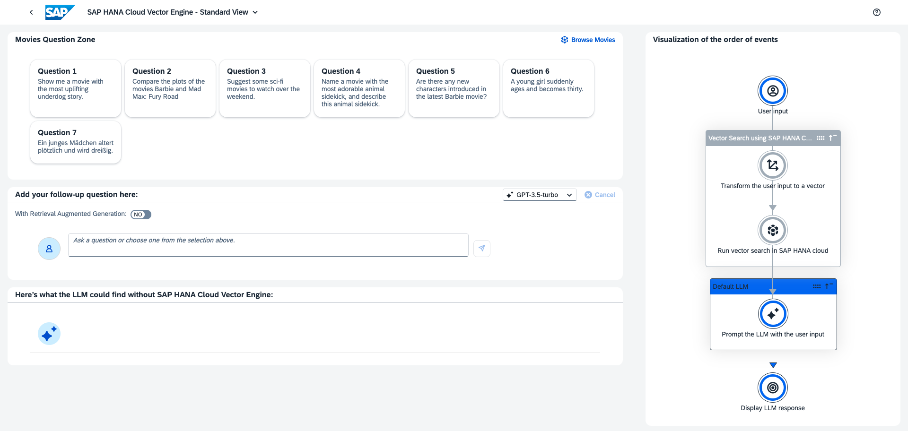

## Details
### What the demo is about

The demo is a focused and intentionally simple RAG (Retrieval Augmented Generation) application.
This means, a request can be sent to a Large Language Model (LLM) but before the request is actually sent, the prompt to the LLM is extended via context information (grounding).

The retrieval of this additional context makes use embedding vectors, which represent a semantiv meaning of a text. The so called `cosine similarity` of two vectors measure the semantic similarity of the texts.

The similarity is independant from text's length, language or wording. The actual qualities depend on the used Embedding Model. The demo makes use of the OpenAI ADA002 Embedding model.

The similarity is a value between `-1.0` and `1.0`, typically positive. The higher, the more similar.

Example:

> A young girl suddenly ages and becomes thirty.

has a cosine similarity of `0.832` to the plot of [13 Going on 30](https://en.wikipedia.org/wiki/13_Going_on_30#Plot), although this text does't contain the words "young", "girl", "suddenly", "age" or "ages" not "thirty" (although the number "30" appear in the text).

This even works with other languages:

> (German) Ein junges Mädchen altert plötzlich und wird dreißig.

Cosine Similarity: `0.785`

> (Ukrainian) молода дівчина стає дорослою і стала трицять

Cosine Similarity: `0.766`

### Features of the Demo

 * Multiple Scenarios
   * Movies (from 1977 to Feb 2024)
   * CAP Documentation (Status April 2nd 2024)
 * The RAG is optinal
   * Compare the results
 * Free text input to phrase a request as well as predefined requests
 * Standard View and Expert View
   * The Standard View directly hides the retrieval of the context. This makes it easier to use
   * The Expert View exposes the retrieval. The Vector Engine Similarity Search is separated from the request to LLM. The top 20 most similar movies are returned. Similarity and Euclidean Distance are shown. A subset of the search result can be selected and the task to the LLM can be phrased separately from search query.
 * Visualisation of Process steps
   * Show the dureation of a process step
   * Schematic view on prompt which is sent to LLM
 * Browse Dataset via a table
 * Link to additional information
 * Anonymous logging of requests

## Connectivity
Your SAP HANA Cloud needs to be at least on the QRC1 2024 version.
You can download the sample data set [here](https://d.dam.sap.com/a/NnpLcEG?rc=10&doi=SAP1119893).

## Download/Install Instructions
This application was build on code from [SAP-samples/btp-cap-genai-rag](https://github.com/SAP-samples/btp-cap-genai-rag/tree/main).
Deployment should be similar, however the current state of this app is Single Tenant on Cloud Foundry (CF) only.

This is only necessary for preparation of the demo. Once all data is imported, the demo be used without further data retrieval.

### How to use the demo
You need to have the Role `Vector Engine Demo Member` assigned and be a developer in the respective BTP space.

Open the URL `<your-app-URL>/aiui-1.0.0/index.html#main`. Might look similar to `https://my-btp-subaccount-space-and-uuid.cfapps.eu12.hana.ondemand.com/aiui-1.0.0/index.html#main`.
The `#main` is important.

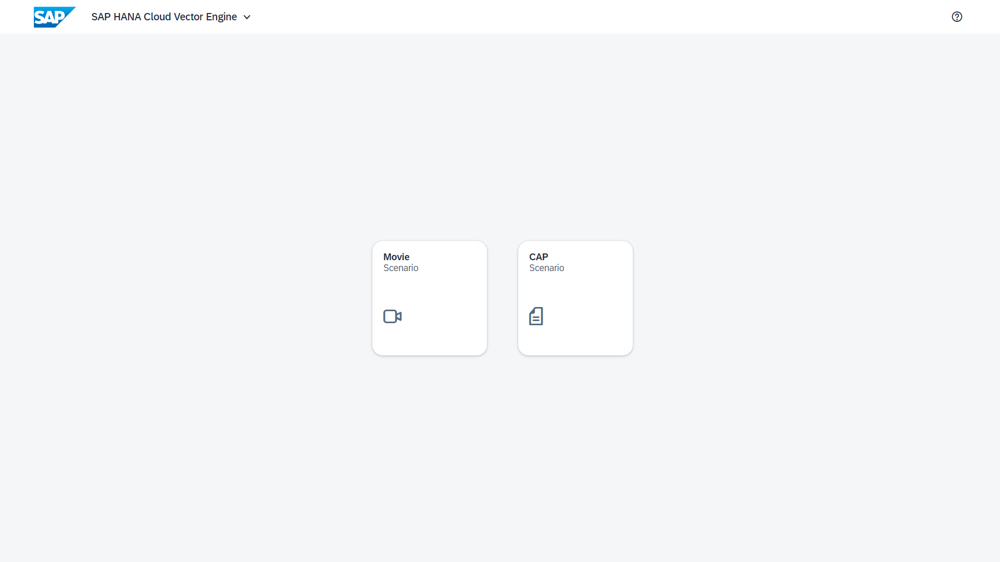

After logging in, you should see the Scenario Selection. Click on the Scenario you want to demonstrate. It will directly lead to the *Standard View* if that scenario.

This is the *Standard View* of the Movie Scenario.

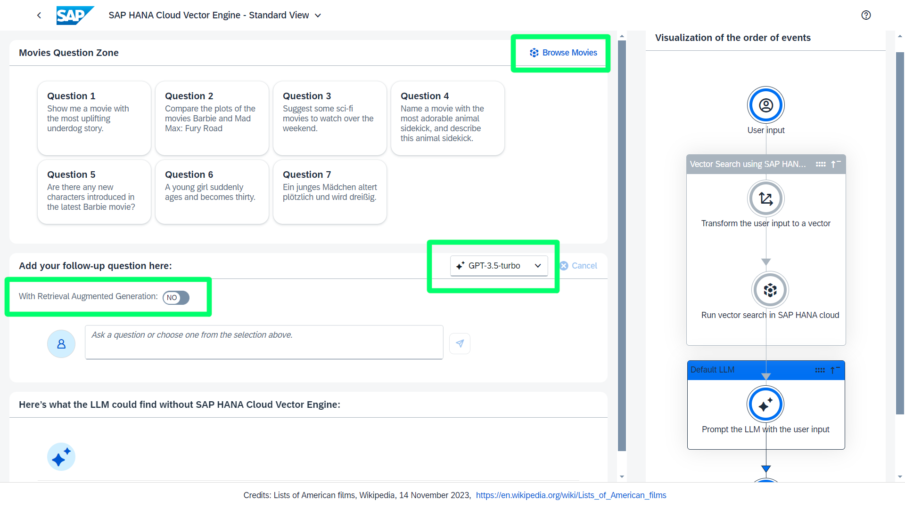

Here are some elements of the Demo Application Highlighted.

Find the *Browse Movies* button in top right corner to open a table to see the stored dataset as a whole.

The middle highlighted area allows you to select the used *LLM model*. In the Movie scenrario GPT 3.5 proved as sufficient while still fast. GPT 4 is instead slower, but the results are of higher quality. Use it in the CAP Documentation scenario.

The Middle left Toggel Button activates the *RAG* process. If toggled off, the request will be sent directly to the LLM and no context from the given scenario dataset it given. If activated, the LLM is grounded by extending the prompt with context from the scenario dataset.

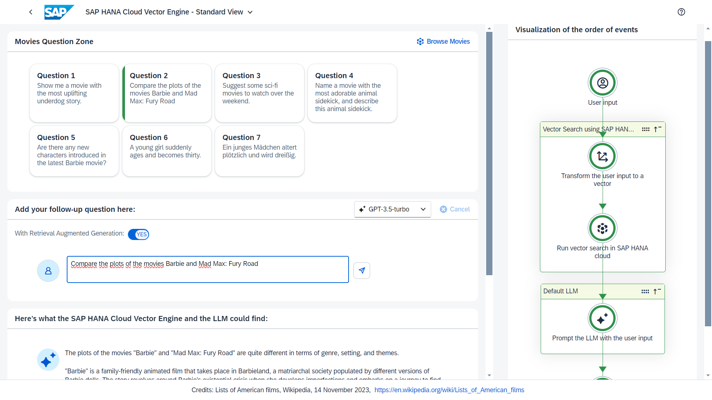

This is how the screen should look after a successful request.

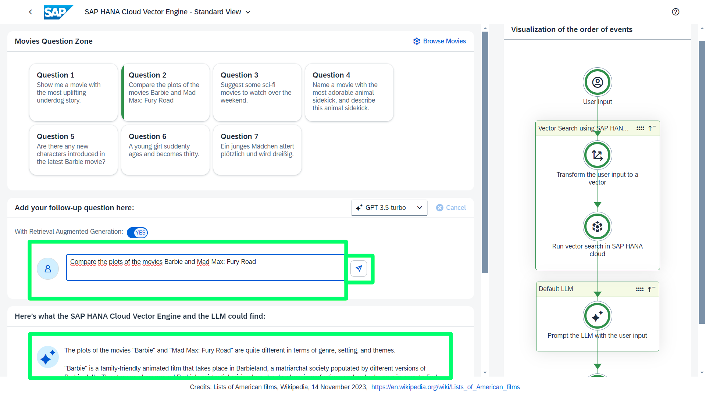

To send a request, you have to fill out the *free text field* for the request. Predefined texts are avaiable as shortcuts above.

If you enter a free text, if will be present as predefined text, however it is not persisted. Refreshing or switching the scenario will remove the new entry.

The *Submit Button* starts the process.

See the response of the LLM in the *Result Area*.

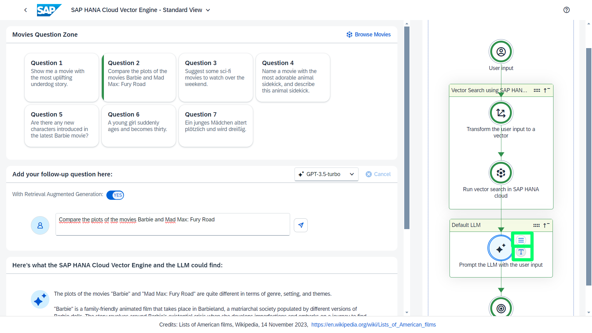

You can check the duration of a process step and the prompt by clicking on the process step element.

The *Three Line Button* shows the duration of this step. This only takes the intenal processing time in account. Not the transfer from the UI to the backend.

The *T Button* is only vailable in the last provess step. It shows a schematic view of the prompt as in the following image.

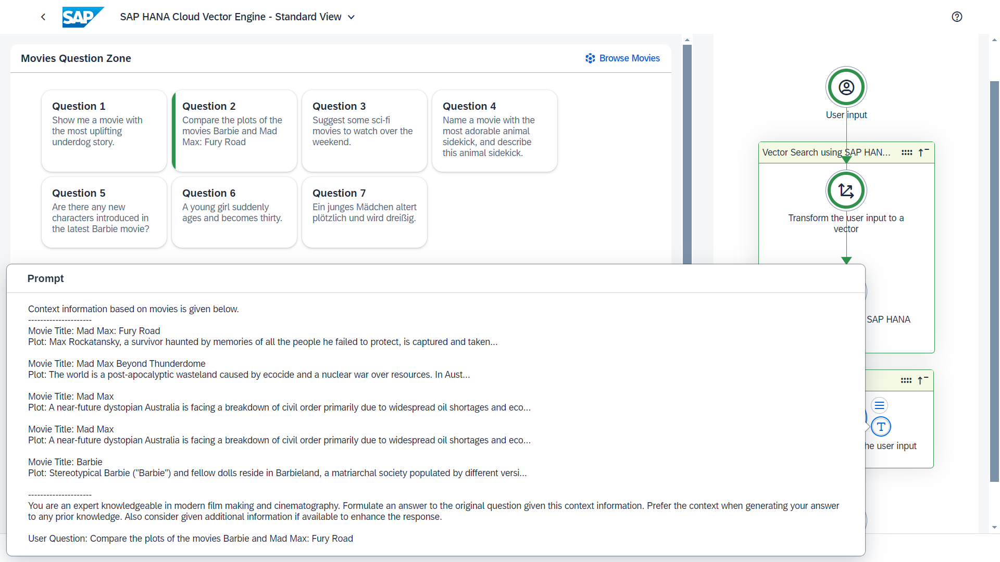

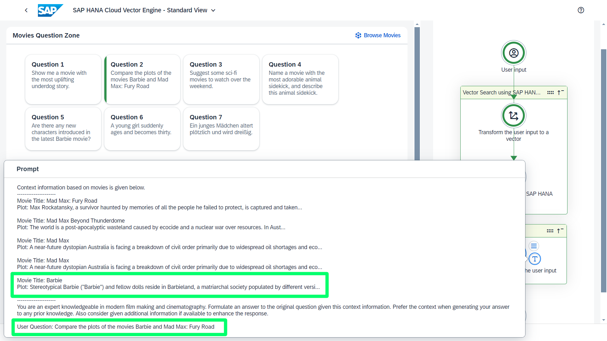

Please be aware, that this is just "almost" the prompt as sent to the LLM. The original prompt is formated slightly different and contains the full plot information.
For the sake of readability, this depiction as *shortened plots* as visible in the top box but still the original *user request* as visible bottom box.

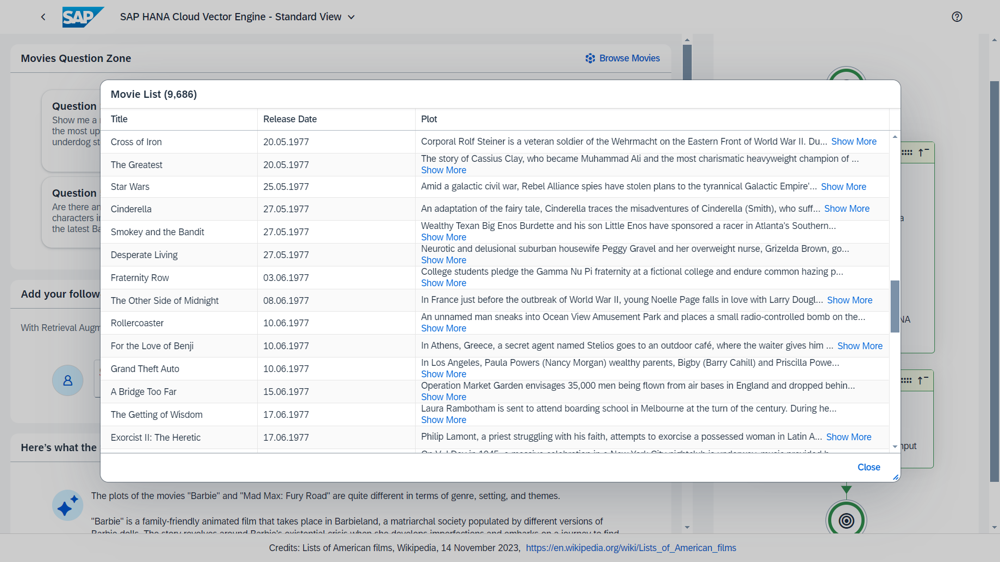

If you click the *Browse Movies* button on top right, you get a table displayed with the whole dataset of the scenario.

On top of the table, you can see the total number of entries, in this image it is 9,686.

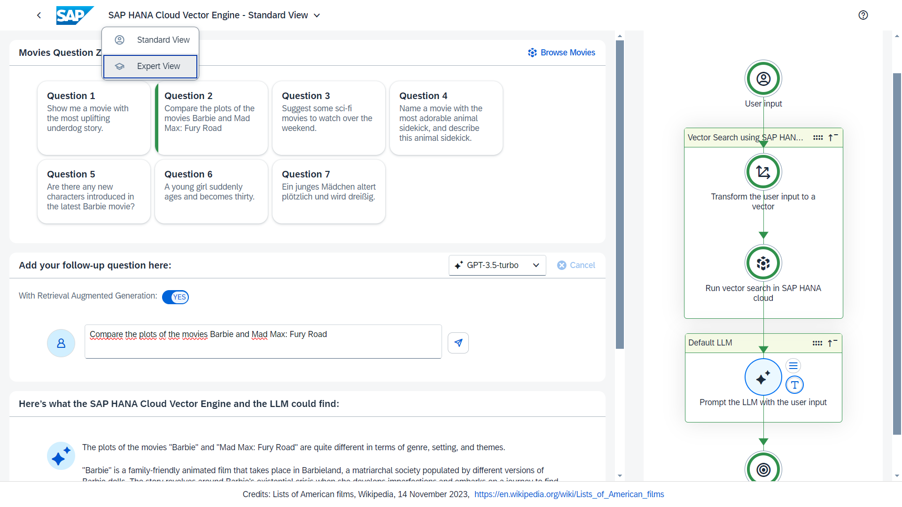

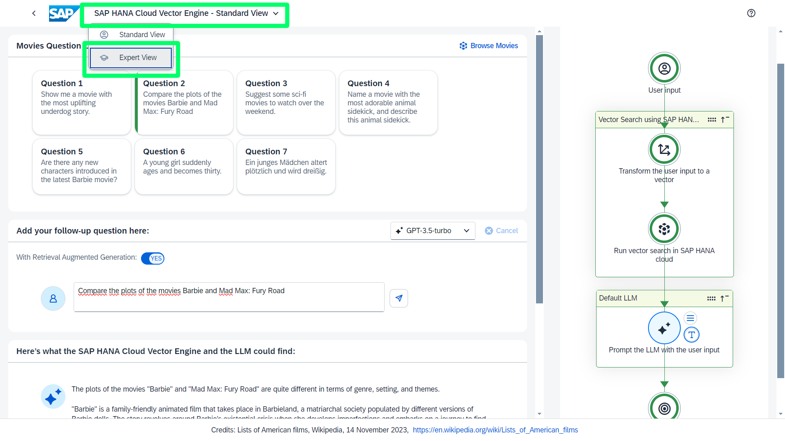

To switch to the Expert view, click the menu on top of window and select *Expert View*

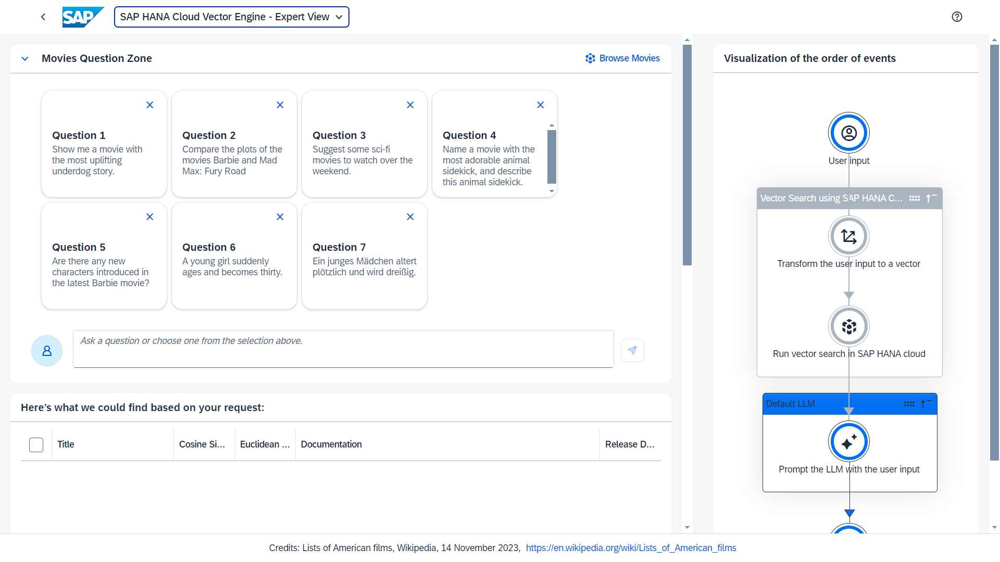

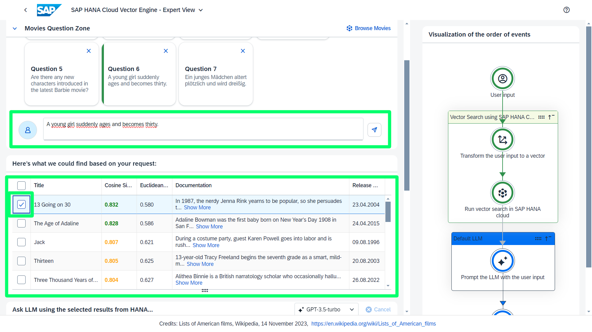

Like in the Standard View, you have a *free text field* to write your request. However, unlike the Standard View, this text will only used as *search query*.

Therefore the result depicted in the big green box is a list of top 20 similar texts to the given text.

The most left column allows a selection. Selected movies will be provided as context when a request is sent to the LLM via the text field below. This behavior differs the Standard View, in which always the top 5 results serve as context. Here, only the selected movies serve as context.

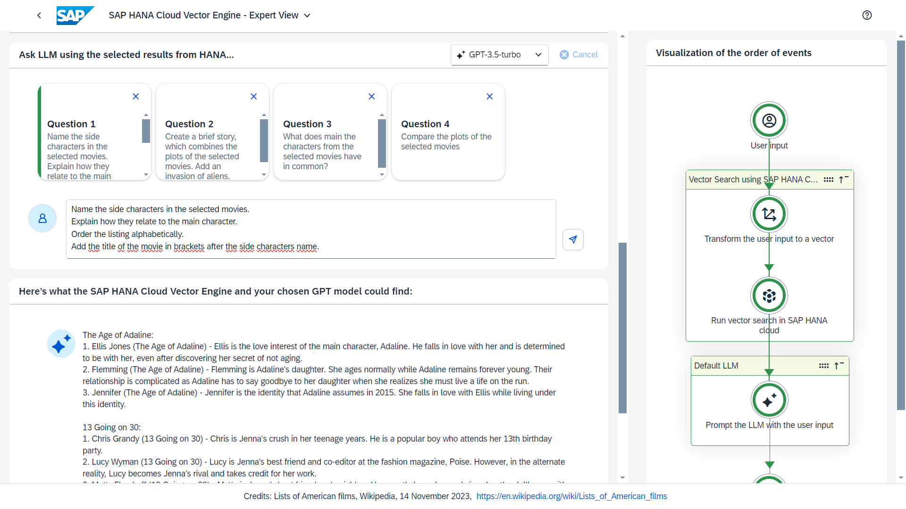

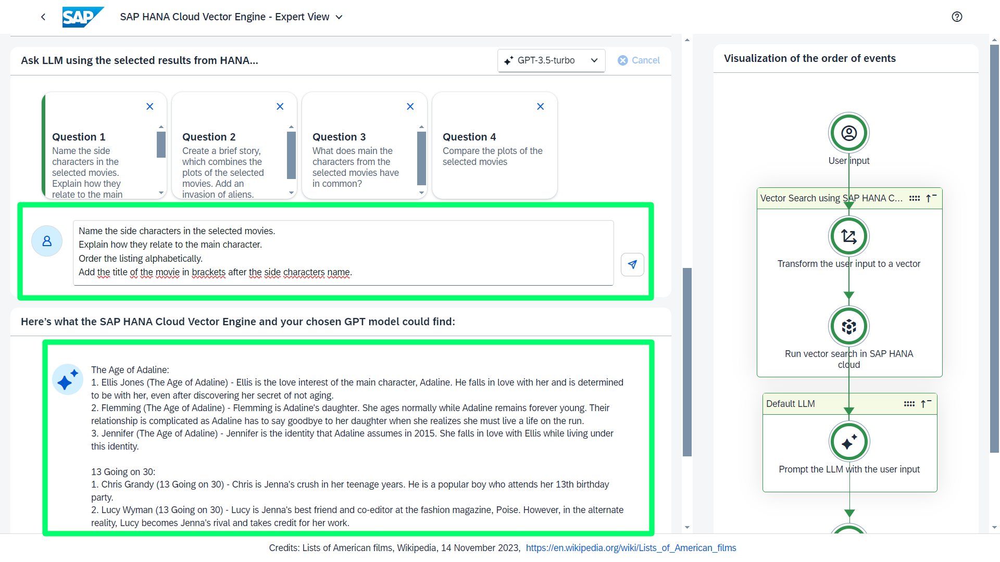

Having the search separated from the LLM request and allowing single selection of movies enables to phrase a task to the LLM more precisely. This could be a more analytical task as in the screenshot.

## More Information
Finding the right texts for requests is not a trivial task.
Therefore we designed [guidelines](./Question-Guidelines.md) to achieve nice presentable results.

## Known Issues
This application was planned and implemented as a demo.
This means functionality and visuals over code cleanliness.

Therefore, the following issues are open. Be aware when hosting it or use as template for development:

 * The Table and Service is names "Movie", although it also contains 
 * Currently no access control is implemented
   * Request Logs and Config data can be accessed
   * Additional data can be imported
 * Some requests only return a string, however this contains a JSON
 * You need the URL parameter `#main` to access the demo
 * We had to set the environment variable manually as "User Provided Variable" on BTP `SESSION_TIMEOUT: 720`
   * Would be cool, if this would happen during deployment
 * There are unused features:
   * Virtual Property `virtualEmbedding` in `data-model.cds`
     * This was an experimental approach to pass the embedding via ODATA
     * Can only be read
     * Implemented in `extendWithVirtualEmbedding` method, but unsure, if this serves all purposes
   * `vector-buffer.ts` when CAP introduces official Vector handling, this became obsolete and isn't used in this application anymore. However, using it, would reduce the load which is sent to HANA

## Contact
N/A

## How to obtain support
[Create an issue](https://github.com/SAP-samples/btp-cap-genai-rag/issues) in this repository if you find a bug or have questions about the content.
 
For additional support, [ask a question in SAP Community](https://answers.sap.com/questions/ask.html).
