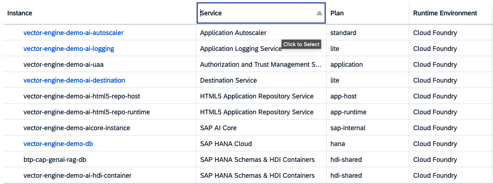

# SETUP VECTOR DEMO FROM SCRATCH

1. Setup BTP subaccount
   - created new subaccount with a fitting name
   - create new space with fitting name
   - Assign the following entitlements: 
   - Set up a HANA Cloud instance according to https://github.com/SAP-samples/btp-cap-genai-rag/blob/main/docs/tutorial/2-setup/3-SAPHANACloud.md
   - Set up SAP AI Hub according to https://github.com/SAP-samples/btp-cap-genai-rag/blob/main/docs/tutorial/2-setup/4-generativeAIhub.md
     - the AI Core destination does not work out of the box after following the official documentation. To create it, we needed to create a AI Core service instance and a service key. That service key will contain a property "AI_API_URL", and the destination connection will only work properly when we manually add a "/v2" to the url
     - even then, the interaction with AI Core did not work properly, and the reason is that in "ai-core.ts" the CONFIGURATION object specifies the falcon model, and that falcon is not supported on eu12!

2. Prepare and deploy application
   - in "deploy/cf", execute "npm run build"
     - if it fails at step "tsc -p ...", run "npm install typescript", and repeat
   - go to /code, execute "npm run build"
   - now, execute "cds deploy --to hana"
   - if "cds" does not work because not found, execute "npm install -g grunt @sap/cds-dk mbt" (and, yes, has to be global); repeat
   - now, three db tables should have been created (if command ran successful)
   - now, go to "/deploy/cf" again and execute "npm run build:deploy"
   - if that fails because of unknown command "cf build", you will need to execute "cf install-plugin multiapps"
       - this should work even if the command "cf repo-plugins" fails with a strange error (on Mac)

3. Prepare the exported database objects for import
   - in this step, we will replace all occurrences of the schema name `5240DEFC7F934AB0A33ED7C7691BE8AF` in the exported catalog objects with the schema name that has been automatically created when setting up the hdi instance as part of the deployment
   - you need to add the "hdi"-tagged hdi-container to the SAP HANA Database Explorer to see the expected tables (most of them empty after deploying the application) and to be able to import the data
   - in SAP HANA Database Explorer, select instance that you just added (it should have the name of the hdi instance created as part of the deployment; for example, the default display name in SAP HANA Database Explorer could look like this: `vector-engine-demo-ai-hdi-container (vector-engine-demo)`)
     - click on the `Tables` entry
     - you should see the following tables being listed:
       - AI_DB_MOVIES
       - AI_DB_QUESTIONSANDANSWERSLOG
       - AI_DB_SCENARIOCONFIG
     - doulble-click on the table `AI_DB_MOVIES` to open its details, and in the upper right corner of the explorer you will the `Schema`, it should look like this: `5240DEFC7F934AB0A33ED7C7691BE8AF`
    - take note of your schema name
   - now, extract `./db-export/ai_db_movies.tar.gz`, you should then have a directory structure that looks like this:
    - `./db-export`
        |- `index`
            |- `5240DEFC7F934AB0A33ED7C7691BE8AF` <-- please note how this is the schema name 
                |- `AI`
                    |- `AI_DB_MOVIES`
                        |- `data.info`
                        |- `data.ctl`
                        |- `data.csv`
                        |- `create.sql`
                        |- `table.xml`
                        |- `export_system.info`
   - now, rename the folder `5240DEFC7F934AB0A33ED7C7691BE8AF` to the schema name recorded in the previous step
   - next, open the file `data.ctl`, and replace `5240DEFC7F934AB0A33ED7C7691BE8AF` in the second line with the schema name recorded in the previous step
   - next, open the file `create.sql` and replace `5240DEFC7F934AB0A33ED7C7691BE8AF` with the schema name recorded in the previous step
   - once you are finished, it's required to compress these catalog objects again, like so:
   - `tar czvf ai_db_movies_adjusted.tar.gz index`

4. Import data into db
   - after having completed step 3, go to SAP HANA Database explorer and select the instance you used to retrieve the schema name in step 3
   - right-click on the instance and select `Import Catalog Objects`
   - in the opening view, select the .tar.gz file created at the end of step 3
