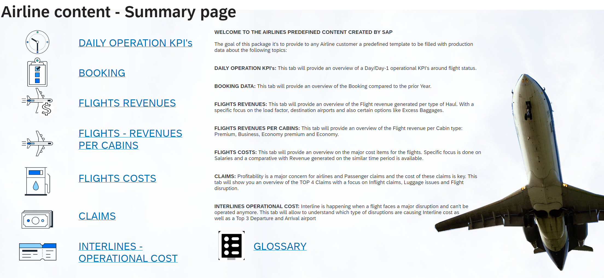

# SAP Airline Overview

## Content Package Files
SAP_CC_SAC_Airline_Overview.Package	

## Last Released:
2024.02

## What´s New
N/A

## Description
This package offers a holistic overview of their daily business to any Airline executive. Predefined templates come with sample data, that can be replaced with the Airline's real data, covering the following topics:

* Daily Operations KPIs
* Bookings  
* Flights Revenues
* Flights Revenues per Cabin
* Flights Costs 
* Claims
* Interlines Operational Costs

## Details
This package contains 5 SAP Analytics Cloud stories and 5 Models with sample data as follows:

**Stories:**

* _SAP_CC_Overview_: This story is the starting point for your analyis. Next to an introduction and a glossary, it provides a dedicated page for each of the topics listed above.
* _SAP_CC_AirFlights_Revenue_And_Cost_: Use this story to analyse costs and revenues. Revenues from passengers and cargo (also divided by type of haul) are compared with Costs of fuel, crew, marketing and overhead.
* _SAP_CC_BookingPerRoute_: Weekly Bookings per Route
* _SAP_CC_DelayFlights_: This story presents the main operational KPIs on a daily basis
* _SAP_CC_PassengersClaims_: Learn about Passengers Claims by route type (also divided by type of haul) plus Interline Costs

**Models:**

* _SAP_CC_AirBooking_: Weekly Bookings for an Year-over-Year Comparison
* _SAP_CC_AirClaims_: Claims raised by Passengers
* _SAP_CC_AirFlights_: Departures and Destinations (Routes)
* _SAP_CC_DelayData_: Daily operational data at flight-date level with expected departure/arrival times and the delays 
* _SAP_CC_DelayTargets_: Aggregate daily targets for departure and arrival

## Connectivity
Sample data has been uploaded from csv files. 

## Download/Install Instructions
Please check the documentation [here](https://help.sap.com/docs/SAP_ANALYTICS_CLOUD/42093f14b43c485fbe3adbbe81eff6c8/603e26204ce14bd8b5f9729a8123636f.html).

## More Information
N/A

## Contact
Questions may be adressed to [Adeem Zia Ul Haq](mailto:adeem.zia.ul.haq@sap.com), [Enrico Micalucci](mailto:enrico.micalucci@sap.com) and [Sebastien Turpin](mailto:sebastien.turpin@sap.com).

