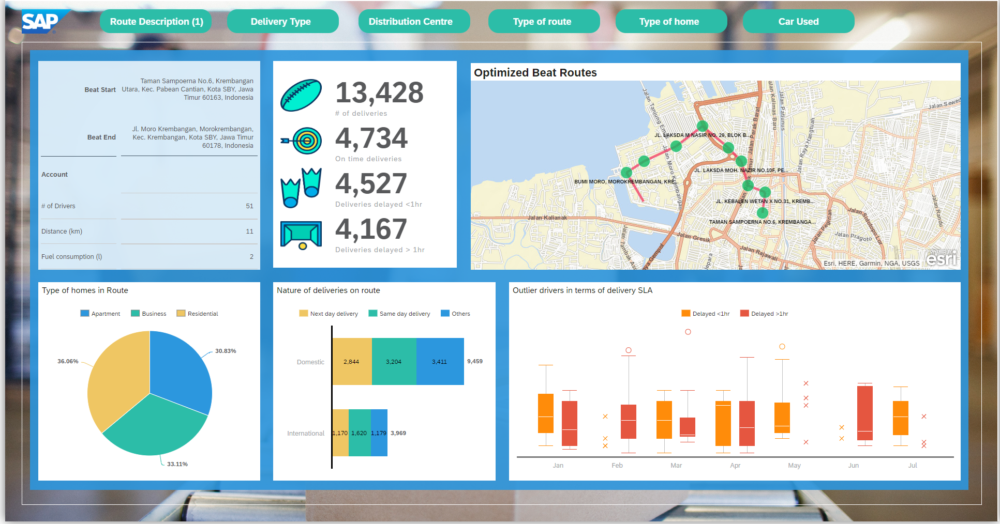

# Postal Delivery Route Optimization

## Content Package Files
SAP_CC_SAC_Postal_Delivery_Route_Optimization.package

## Last Released:
2024.10

## What´s New
The Postal Delivery Route Optimization content package contains classic stories or classic analytical applications.
As explained in this [blog](https://community.sap.com/t5/technology-blogs-by-sap/important-notice-changes-in-sap-analytics-cloud-classic-stories-amp/ba-p/13705220), it will no longer be supported to import this content package starting with 2024 Q4 QRC for new tenants only, as it contains Classic Stories or Analytic Applications.
Once the SAP Analytics Cloud Classic Experience for Stories and Analytic Applications will no longer be supported in general, this package will be deprecated (current planning: 2025 Q2 QRC).

## Descripton
Business Challenge:
Unpredictable events like delays in arrival of cargo flights, traffic congestion, unavailable drivers or breakdowns of delivery vehicles can cause delays in day to day package deliveries. For regional managers, it is paramount to stop these factors from affecting SLAs. This can be achieved if route optimization models can quickly factor in new parameters to minimize the number of delayed deliveries. Also, actual delivery on the ground may deviate from simulated volumes, so regional managers may want to revise routes that have been over or underutilized with time. That's where they need a user-friendly and intuitive visualization tool that can analyze real time situations and factors to measure the impact of accepting optimization recommendations for tactical and strategic re-routing accordingly.

Solution:
We built this scenario onto SAP Analytics Cloud, on top of data from the optimization models. Regional managers can have a quick overview of postal delivery volumes, SLA violations, route utilizations and more. They can delve deeper into individual routes and investigate the causes of SLA disruptions in regions with more lapses than others and drivers with a higher tendency to be late than others. They can track their delivery fleets in real time by nature of vehicle, drivers and the source collection centres. The tactical and strategic routing sheets analyze both internal or external reasons for delays to derive re-route recommendations, where users can communicate re-route approvals to operational managers. The retrospective analysis of different outcomes if different routes are adopted allow for better decision making. Social media sentiment analysis and Qualtrics surveys then help regional managers gauge how consumers feels about the delivery service.

## Details
SAC stories, Models with acquired data

## Connectivity
N/A. Acquired data model from excel

## Download/Install Instructions
Please check the documentation [here](https://help.sap.com/docs/SAP_ANALYTICS_CLOUD/42093f14b43c485fbe3adbbe81eff6c8/ef516563b3fe4c69b6f718f17ed94cdf.html).

## More Information
N/A

## Contact
N/A