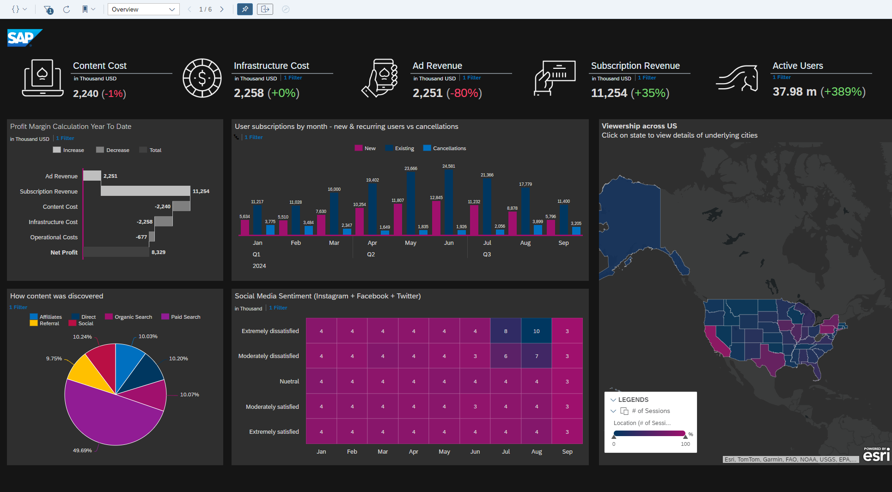

# UX Analytics for OTT APP Dashboard

## Content Package Files
SAP_CC_SAC_UX_Analysis_for_OTT.package

## Last Released:
2024.01

## What´s New
N/A (initial release)

## Descripton
Business Challenge:
The key ask from the customer was to make the app more desirable, more intelligent, and more customizable— so it is able to continuously adapt the user experience as it learns about its users' content preferences. This way, the app can position itself as a lifestyle partner of choice as it becomes integrated into the user's daily life. Also, unlike traditional television where data on viewership is incomplete or hard to obtain, OTT apps sit on a treasure trove of usage information including demographics, viewing behavior and individual viewing preferences. We can utilize these analytics to help revenue and content managers understand audiences better so they can drive higher viewership and better monetization.

Solution:
The existing app interface was enhanced by adding intelligence at every touchpoint, dynamically adapting to users' preferences. A super personalized chat assistant that caters to user needs based on context can recommend ideas to users on how to spend the evening based on their lifestyle habits by combining content recommendations with dine-in options. All recommendations are tailored to historical user preferences, where all in-app consumer feedback is collected for the Machine Learning models that drive these recommendations for future. Even online shopping options can be linked for users interested in buying items seen on their favorite shows worn by its characters, creating a new ecosystem of social commerce. This elevates the OTT app from simply being a content provider, offering various options for dining, shopping, learning and more. Furthermore, trends in subscriptions are tied in with sentiment data from social media, sources of subscription referrals and user locations. Content managers can analyze viewing behavior by user demographics and revenue managers can have insights on costs vs revenue by subscription type or location, among other factors. And marketing managers can track expenditure by campaigns, reach, ROI and A-B testing for measuring campaign impact.

## Details
SAP Analytics Cloud Story "TV Analytics Control Tower" plus models with pre-filled sample data 

## Connectivity
N/A. Data models come with sample data

## Download/Install Instructions
Please check the documentation [here](https://help.sap.com/docs/SAP_ANALYTICS_CLOUD/42093f14b43c485fbe3adbbe81eff6c8/ef516563b3fe4c69b6f718f17ed94cdf.html).

## More Information
N/A

## Contact
Please contact [Islam Rafiq](mailto:Islam.rafiq@sap.com).
