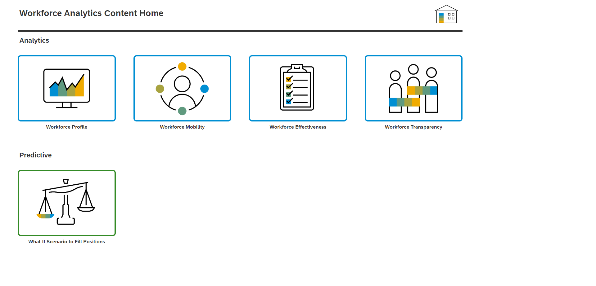

# Worforce Analytics 

## Content Package Files
SAP_CC_SAC_Workforce_Analytics.package 

## Last Released:
2024.03

## What´s New
Converted to Optimized Design Experience

## Descripton
A service offering melding together the functionality of SAP SuccessFactors Workforce Analytics (WFA) with
SAP Analytics Cloud (SAC) technology. The solution combines the power of WFA’s data transformation with
the visualizations, planning and predictive functionality of SAC. The result is a modern and intuitive
interface empowering users to analyze data and create actionable insights.

## Details
Please check SAP_CC_Workforce_Analytics_Demo_19130.pdf for details about this content.

## Connectivity
Data Models already include sample data.

## Download/Install Instructions
Import the content package into your tenant, following the documentation [here](https://help.sap.com/docs/SAP_ANALYTICS_CLOUD/42093f14b43c485fbe3adbbe81eff6c8/603e26204ce14bd8b5f9729a8123636f.html). 

To setup the predictive scenario, please follow the instructions in SAP_CC_Workforce_Analytics_Demo_19130 - Predictive_Setup.pdf.

## More Information
N/A

## Contact
N/A

