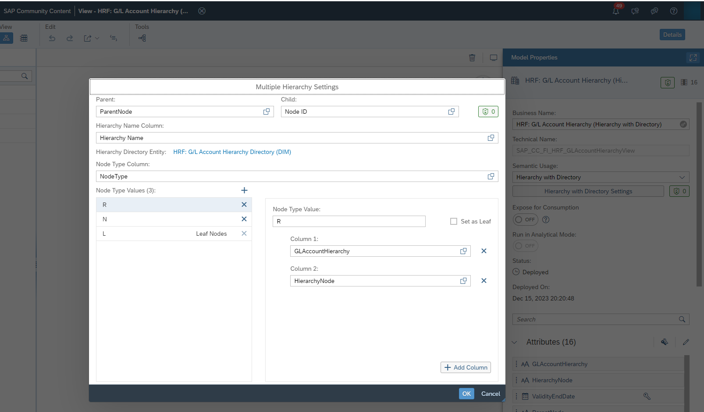
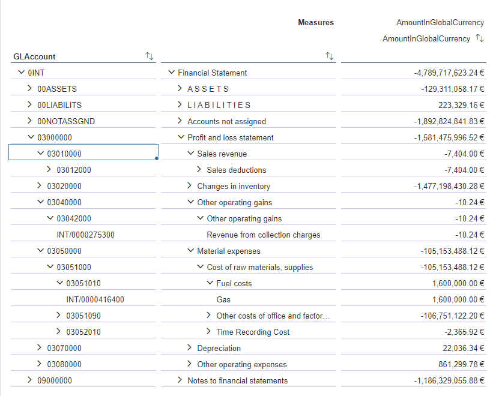

# Hierarchy with Directory Samples

## Content Package Files

SAP_CC_DSP_Hierarchy_With_Directory_Sample_GLAccount_for_Replication_Flow.package  
SAP_CC_DSP_Hierarchy_With_Directory_Sample_CostCenter_for_Replication_Flow.package  

SAP_CC_DSP_Hierarchy_With_Directory_Sample_GLAccount_for_Remote_Table_for_S4HOnPremise.package  
SAP_CC_DSP_Hierarchy_With_Directory_Sample_CostCenter_for_Remote_Table_for_S4HOnPremise.package  

SAP_CC_DSP_Hierarchy_With_Directory_Sample_GLAccount_for_Remote_Table_for_S4HCloud.package  
SAP_CC_DSP_Hierarchy_With_Directory_Sample_CostCenter_for_Remote_Table_for_S4HCloud.package  

## Last Released:
2024.01

## What´s New

## Descripton
These community content packages help you to easily utilize the SAP Datasphere feature _"Hierarchies with External Hierarchy Directory"_.

**Note**: Don't miss to read the blog series _Hierarchy with Directory in SAP Datasphere_ of currently 5 blog post starting with:   [An Introduction to Hierarchy with Directory in SAP Datasphere](https://blogs.sap.com/2024/01/15/an-introduction-to-hierarchy-with-directory-in-sap-datasphere)  

The packages includes examples for the G/L Account Hierarchy and the Cost Center Hierarchy for the following scenarios:

A. Replication flow with local table for SAP S/4HANA (on premise) 2021 or newer and SAP S/4HANA Cloud  
B. Remote Table for SAP S/4HANA (on premise) 2021 or newer  
C. Remote Table for SAP S/4HANA Cloud  

To assist Datasphere users, these packages provide local tables or remote tables, views for hierarchies and dimensions for G/L Account hierarchy or Cost Center hierarchy.
Choose the package(s) for your prefered replication option: 

**A. Replication Flow for both SAP S/4HANA (on premise) and SAP S/4HANA Cloud:**  
SAP_CC_DSP_Hierarchy_With_Directory_Sample_GLAccount_for_Replication_Flow.package 
SAP_CC_DSP_Hierarchy_With_Directory_Sample_CostCenter_for_Replication_Flow.package.  
As source system use either a SAP S/4HANA (on premise) 2021 or newer or SAP S/4HANA Cloud system. It is recommended to use the connection name SAP_S4H or SAP_S4HC as well as the space SAP_COMMUNITY, but it is not mandatory. 

**B. Remote Tables for a SAP S/4HANA (on premise):**  
SAP_CC_DSP_Hierarchy_With_Directory_Sample_GLAccount_for_Remote_Table_for_S4HOnPremise.package 
SAP_CC_DSP_Hierarchy_With_Directory_Sample_CostCenter_for_Remote_Table_for_S4HOnPremise.package.  
As source system use a SAP SAP S/4HANA (on premise) 2021 or newer and use the connection name SAP_S4H (mandatory) to successfully import the packages into your Community Content space SAP_COMMUNITY (mandatory).

**C. Remote Tables for a SAP S/4HANA Cloud:**  
SAP_CC_DSP_Hierarchy_With_Directory_Sample_GLAccount_for_Remote_Table_for_S4HCloud.package 
SAP_CC_DSP_Hierarchy_With_Directory_Sample_CostCenter_for_Remote_Table_for_S4HCloud.package.   
As source system use a SAP SAP S/4HANA Cloud system and use the connection name SAP_S4HC (mandatory) to successfully import the packages into your Community Content space SAP_COMMUNITY (mandatory).

Hierarchy with Directory: HRF: G/L Account Hierarchy (Hierarchy with Directory):  

Sample Analytic Model - Preview:  

## Details
**Recommmenation:**  
We recommend to use the Replication Flow option. When using remote tables, only the internal keys of the hierarchy nodes are displayed, but not the keys as displayed in SAP S/4HANA. For the leaves the keys are the ones that you also see in SAP S/4HANA.

Please see the detailed descriptions below for the respective scenario:

**A. Replication Flow**  
After the successfull import of the desired package, create a connection to your SAP S/4HANA 2021 or newer or SAP S/4HANA cloud system and create a Replication Flow to replicate data into the local tables: 

Each of the 2 packages includes all local tables and views to load data from the following CDS Views:
I_GLACCOUNTINCHARTOFACCOUNTS  
I_GLACCOUNTTEXTRAWDATA  
I_GLACCOUNTHIERARCHY  
I_GLACCOUNTHIERARCHYTEXT  
I_GLACCOUNTHIERARCHYNODE  
I_GLACCOUNTHIERARCHYNODET  

I_COSTCENTER  
I_COSTCENTERTEXT  
I_COSTCENTERHIERARCHY  
I_COSTCENTERHIERARCHYTEXT  
I_COSTCENTERHIERARCHYNODE  
I_COSTCENTERHIERARCHYNODET  

Make sure, that you map the CDS Views for G/L Account or Cost Center to the  local tables in your Replication Flow and load the data:

CDS Views | SAP Datasphere local table
--- | ---
I_GLACCOUNTINCHARTOFACCOUNTS | SAP_CC_FI_HRF_IL_I_GLACCOUNTINCHARTOFACCOUNTS
I_GLACCOUNTTEXTRAWDATA | SAP_CC_FI_HRF_IL_I_GLACCOUNTTEXTRAWDATA
I_GLACCOUNTHIERARCHYTEXT | SAP_CC_FI_HRF_IL_I_GLACCOUNTHIERARCHYTEXT  
I_GLACCOUNTHIERARCHY | SAP_CC_FI_HRF_IL_I_GLACCOUNTHIERARCHY  
I_GLACCOUNTHIERARCHYNODE | SAP_CC_FI_HRF_IL_I_GLACCOUNTHIERARCHYNODE  
I_GLACCOUNTHIERARCHYNODET | SAP_CC_FI_HRF_IL_I_GLACCOUNTHIERARCHYNODET  

CDS Views | SAP Datasphere local table
--- | ---
I_COSTCENTER | SAP_CC_FI_HRF_IL_I_COSTCENTER  
I_COSTCENTERTEXT | SAP_CC_FI_HRF_IL_I_COSTCENTERTEXT  
I_COSTCENTERHIERARCHY | SAP_CC_FI_HRF_IL_I_COSTCENTERHIERARCHY  
I_COSTCENTERHIERARCHYTEXT | SAP_CC_FI_HRF_IL_I_COSTCENTERHIERARCHYTEXT  
I_COSTCENTERHIERARCHYNODE | SAP_CC_FI_HRF_IL_I_COSTCENTERHIERARCHYNODE  
I_COSTCENTERHIERARCHYNODET | SAP_CC_FI_HRF_IL_I_COSTCENTERHIERARCHYNODET  

Now create an association in your fact view to the G/L Account Dimension view (SAP_CC_FI_HRF_GLAccount) or the Cost Center view (SAP_CC_FI_HRF_CostCenter) and create an Analytic Model to use the hierarchy feature in your SAP Analytic Cloud Story. In case an Analytic Model already exists for your fact view, redeploy the Analytic Model. After you have loaded you fact view data you can choose the respective hierarchy in your SAP Analytic Cloud Story.

**B. Remote Tables for SAP S/4HANA (on premise)**  
First create a connection for your SAP S/4HANA (on premise) 2021 or newer system called SAP_S4H and import the desired package.

Each of the 2 packages includes all remote tables and views, which use the following CDS Views:

CDS Views | SQL name | SAP Datasphere remote table
--- | --- | ---
I_GLACCOUNTINCHARTOFACCOUNTS | IFIGLACCINCOA | SAP_CC_FI_HRTOP_IL_IFIGLACCINCOA 
I_GLACCOUNTTEXTRAWDATA | IFIGLACCTTRD | SAP_CC_FI_HRTOP_IL_IFIGLACCTTRD  
I_GLACCOUNTHIERARCHY | IFIGLACCOUNTH | SAP_CC_FI_HRTOP_IL_IFIGLACCOUNTH  
I_GLACCOUNTHIERARCHYTEXT | IFIGLACCOUNTHT | SAP_CC_FI_HRTOP_IL_IFIGLACCOUNTHT 
I_GLACCOUNTHIERARCHYNODE | IFIGLACCOUNTHN | SAP_CC_FI_HRTOP_IL_IFIGLACCOUNTHN  
I_GLACCOUNTHIERARCHYNODET | IFIGLACCOUNTHNT | SAP_CC_FI_HRTOP_IL_IFIGLACCOUNTHNT  

CDS Views | SQL name | SAP Datasphere remote table
--- | --- | ---
I_COSTCENTER | IFICOSTCENTER) | SAP_CC_FI_HRTOP_IL_IFICOSTCENTER  
I_COSTCENTERTEXT | IFICOSTCENTERT | SAP_CC_FI_HRTOP_IL_IFICOSTCENTERT  
I_COSTCENTERHIERARCHY | IFICOSTCENTERH | SAP_CC_FI_HRTOP_IL_IFICOSTCENTERH 
I_COSTCENTERHIERARCHYTEXT | IFICOSTCENTERHT | SAP_CC_FI_HRTOP_IL_IFICOSTCENTERHT  
I_COSTCENTERHIERARCHYNODE | IFICOSTCENTERHN | SAP_CC_FI_HRTOP_IL_IFICOSTCENTERHN
I_COSTCENTERHIERARCHYNODET | IFICOSTCTRHNT | SAP_CC_FI_HRTOP_IL_IFICOSTCTRHNT

Now you must persist the following view SAP_CC_FI_HRTOP_IL_H_GLAccountHierNode (which uses the remote table SAP_CC_FI_HRTOP_IL_IFIGLACCOUNTHN) or if you are interested in the cost center hierarchy persist the view SAP_CC_FI_HRTOP_IL_H_CostCtrHierNode (which uses the remote table SAP_CC_FI_HRTOP_IL_IFICOSTCENTERHN) by loading a new snapshot. 
If you want you can persist all other remote tables.

Now create an association in your Fact View to the G/L Account Dimension view (SAP_CC_FI_HRTOP_GLAccount) or the Cost Center view (SAP_CC_FI_HRTOP_CostCenter) and create an Analytic Model to use the hierarchy feature in your SAP Analytic Cloud Story. In case an Analytic Model already exists for your fact view, redeploy the Analytic Model. Then you can choose the respective hierarchy in your SAP Analytic Cloud Story.

**C. Remote Tables for SAP S/4HANA Cloud**  
First create a connection for your SAP S/4HANA Cloud system called SAP_S4HC and import the desired package.

The corresponding remote tables are called:
SAP_CC_FI_HRTCL_IL_I_GLACCOUNTINCHARTOFACCOUNTS  
SAP_CC_FI_HRTCL_IL_I_GLACCOUNTTEXTRAWDATA  
SAP_CC_FI_HRTCL_I_GLACCOUNTHIERARCHY  
SAP_CC_FI_HRTCL_I_GLACCOUNTHIERARCHYTEXT  
SAP_CC_FI_HRTCL_I_GLACCOUNTHIERARCHYNODE  
SAP_CC_FI_HRTCL_I_GLACCOUNTHIERARCHYNODET  

SAP_CC_FI_HRTCL_IL_I_COSTCENTER  
SAP_CC_FI_HRTCL_IL_I_COSTCENTERTEXT  
SAP_CC_FI_HRTCL_IL_I_COSTCENTERHIERARCHY  
SAP_CC_FI_HRTCL_IL_I_COSTCENTERHIERARCHYTEXT  
SAP_CC_FI_HRTCL_IL_I_COSTCENTERHIERARCHYNODE  
SAP_CC_FI_HRTCL_IL_I_COSTCENTERHIERARCHYNODET  

Remote tables may always be persisted.
Now create an association in your Fact View to the G/L Account Dimension view (SAP_CC_FI_HRTCL_GLAccount) or the Cost Center view (SAP_CC_FI_HRTCL_CostCenter) and create an Analytic Model to use the hierarchy feature in your SAP Analytic Cloud Story. In case an Analytic Model already exists for your fact view, redeploy the Analytic Model. Then you can choose the respective hierarchy in your SAP Analytic Cloud Story.

For the cost center hierarchy you need to filter your Fact View to exclude records where the cost center is not filled.

## Connectivity
Dependent on the connectivity scenario the respective packages either (A.) uses local tables to be loaded via Replication Flow technology, (B.) remote tables with an SAP S/4HANA (on premise) connection names SAP_S4H or (C.) remote tables with an SAP S/4HANA Cloud Connection named SAP_S4HC.

## Download/Install Instructions
Please check the documentation [here](https://help.sap.com/docs/SAP_ANALYTICS_CLOUD/42093f14b43c485fbe3adbbe81eff6c8/603e26204ce14bd8b5f9729a8123636f.html).

## More Information
N/A  

## Contact
N/A  
