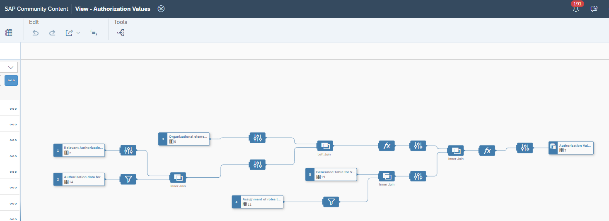

# Integrate SAP S/4HANA authorizations into SAP Datasphere

## Content Package Files

SAP_CC_DSP_Authorization_Import.package

## Last Released:
2024.11

## What´s New
Initial release

## Descripton
This community content package helps you to easily integrate authorization values from SAP S/4HANA utilizing the SAP Datasphere feature _"Operator and Values Data Access Control"_.
It provides a graphical view that provides authorization data from SAP S/4HANA in format that can be used as the basis for Data Access Controls in SAP Datasphere.

Use this package to integrate authorization values from your SAP S/4HANA system to apply row-level security that is aligned with the authorizations of your ERP system.
For this alignment you need to define which authorization objects are to be used.
Example: you want to implement authorization checks on company code level. Then you need to define from which authorization object in SAP S/4HANA the authorizations shall be read.

It contains the following objects:
A. Table to configure the relevant authorization objects (SAP_CC_S4AUTH_REL_OBJECTS)
B. View based on remote tables tjat (SAP_CC_AUTHORIZATION_VALUES)
C. Remote tables for the relevant data from SAP S/4HANA

## Details
**Recommmenation:**  
First create a connection for your SAP S/4HANA system in the SAP_COMMUNITY space called "SAP_S4H". Now you can import the content package.

The corresponding remote tables are called and the user in the connection must be authorized to access the following tables:  
AGR_1251  
AGR_1252  
AGR_USERS  
PUSER002  

Now maintain the technical names of the relevant authorization objects in table SAP_CC_S4AUTH_REL_OBJECTS (using the Data Editor in the local table editor).
Then create a new Data Access Control with structure "Operator and Values. based on the view and map the fields from the fields according to their name.
For more information on this feature see [here](https://help.sap.com/docs/SAP_DATASPHERE/be5967d099974c69b77f4549425ca4c0/501594bf2afb4e49ab5ce254e35e3504.html).

The recommendation is to create separate Data Access Control for each scenario (authorization object) for better lineage analysis.

## Connectivity
This packages uses remote tables build on SAP S/4HANA connection SAP_S4H.
Generally the package should also work with SAP ECC and all other ABAP/Netweaver based systems.

## Download/Install Instructions
Please check this [blog post](https://community.sap.com/t5/technology-blogs-by-sap/integrate-sap-s-4hana-authorizations-into-sap-datasphere/ba-p/13644117) and the documentation [here](https://help.sap.com/docs/SAP_ANALYTICS_CLOUD/42093f14b43c485fbe3adbbe81eff6c8/603e26204ce14bd8b5f9729a8123636f.html)

## More Information
N/A  

## Contact
[Jens Braun](mailto:jens.braun@sap.com)
