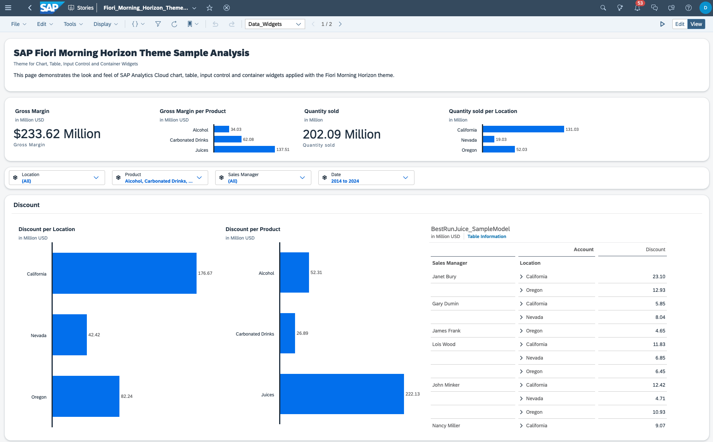

# Fiori Morning Horizon Theme

## Content Package Files
SAP_CC_SAC_Fiori_Morning_Horizon_Theme (1.0.4).package

## Last Released:
2024.03

## What´s New
New theme and template version offered, minor bugs fixed

## Descripton
This content package includes the Fiori Morning Horizon sample theme, along with a related sample story and two story templates. 

## Details
The content packages includes:
* Fiori Morning Horizon Theme 
* sample story: Fiori_Morning_Horizon_Sample_Story
* template: Exploration
* template: Reporting

## Connectivity
The sample story is based on the Best Run Juice sample data model (already available in all SAP Analytics Cloud tenants).

## Download/Install Instructions
Please check the documentation [here](https://help.sap.com/docs/SAP_ANALYTICS_CLOUD/42093f14b43c485fbe3adbbe81eff6c8/ef516563b3fe4c69b6f718f17ed94cdf.html).
In case you have downloaded on older version of the content, please delete the old content first or move it to a different folder before importing the attached content package. 

## More Information
For more details, please refer to our blog [here](https://community.sap.com/t5/technology-blogs-by-sap/horizon-theme-and-templates-for-stories-in-sap-analytics-cloud/ba-p/13657027).

## Contact
N/A

