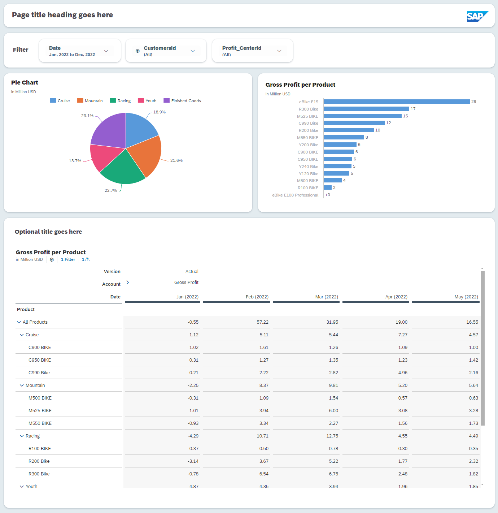

# SAC UI-theming basics

## Content Package Files
UI_theming_basics_content.package

## Last Released:
2024.04

## What´s New

## Descripton
This easy-to-follow guide will walk you through UI-theming basics, with a focus on the canvas page layout. By following these steps, you'll be able to create a unique look and feel for your SAC stories.

Here are some of the things you'll learn in this post:
• Create Canvas Layout
• Create Theme
• Set your global settings in your theme Custom CSS
• Packaging up the theme and CSS codes
• Adjust layout with grid

The following objects are included:
• UI_Theming_Basics_END (Story file)
• UI_Theming_Basics_START (Story file)
• SAP_BestRun (Sample Data)
• UI_basics_light_theme (Theme file)

## Connectivity
N/A

## Download/Install Instructions
Please check the documentation [here](https://help.sap.com/docs/SAP_ANALYTICS_CLOUD/42093f14b43c485fbe3adbbe81eff6c8/603e26204ce14bd8b5f9729a8123636f.html).

## More Information
Check our Blogs [here](https://community.sap.com/t5/c-khhcw49343/SAP+Analytics+Cloud/pd-p/67838200100800006884) and [here](https://community.sap.com/t5/c-khhcw49343/Data+and+Analytics/pd-p/87817424-f4e7-46f2-af14-88bf0f4ba034)

## Contact
[Hyun Lee](mailto:hyun.lee@sap.com)
SAP SE
Sr. UX Design Specialist

